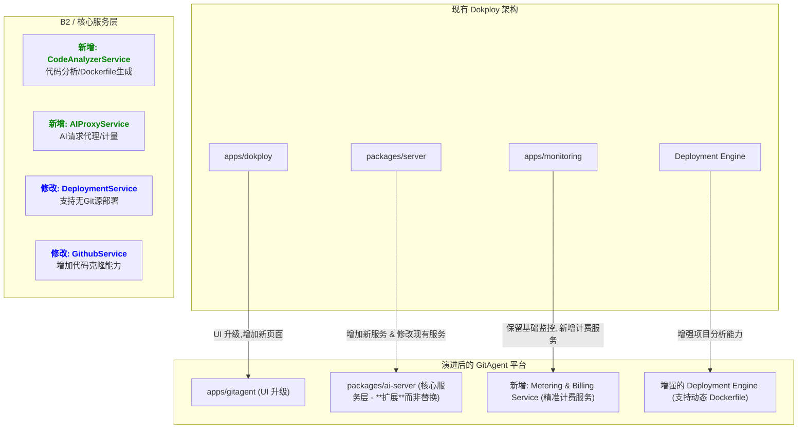

# GitAgent AI 智能体平台 - 基于 Dokploy 的深度集成二次开发方案 (Gemini 2.5 Pro Edition)

## 1. 核心设计哲学：集成而非替换

与简单地引入 `Terraform` 或 `Ansible` 等全新、重型工具栈的方案不同，本方案的核心在于**深度集成和增强**。Dokploy 已拥有一套稳定、高效的基于 Docker Swarm 的部署引擎。我们的策略是：

1.  **增强“大脑”**：赋予 Dokploy 识别、分析和理解 GitHub 项目的能力。
2.  **复用“四肢”**：利用其现有的部署、队列和 API 服务来执行任务。
3.  **新增“感官”**：植入精细化的计费和用量监控触手。

这种方式可以最大限度地保留原有系统的稳定性，降低开发成本和风险，实现真正的“站在巨人肩膀上”。

## 2. 架构演进：精准扩展

我们将对现有架构进行如下演进，每个改动都指向明确的目标：



## 3. 数据库模型：深度关联

为支撑新功能，并与现有模型深度整合，我们设计了以下数据表。注意 `ai_projects` 与 Dokploy 原有 `applications` 表的关联，这是实现无缝集成的关键。

```typescript
// packages/server/src/db/schema/ai-projects.ts (新增文件)
import { pgTable, uuid, varchar, text, integer, timestamp, jsonb } from 'drizzle-orm/pg-core';
import { applications } from './application'; // 导入现有 applications 表
import { users } from './user'; // 导入现有 users 表

// AI项目市场中展示的项目
export const aiMarketplaceProjects = pgTable('ai_marketplace_projects', {
  id: uuid('id').primaryKey().defaultRandom(),
  name: varchar('name', { length: 255 }).notNull(),
  description: text('description'),
  githubUrl: varchar('github_url', { length: 255 }).notNull().unique(),
  // ... 其他市场展示信息: stars, forks, language ...
});

// 用户从 GitHub 导入并部署的项目实例
export const userDeployedProjects = pgTable('user_deployed_projects', {
  id: uuid('id').primaryKey().defaultRandom(),
  userId: uuid('user_id').references(() => users.id).notNull(),
  // 关键关联: 直接链接到 Dokploy 的核心 applications 表
  dokployApplicationId: uuid('dokploy_application_id').references(() => applications.id).notNull().unique(),
  githubUrl: varchar('github_url', { length: 255 }).notNull(),
  // code-analyzer 分析结果缓存
  analysisCache: jsonb('analysis_cache'),
  createdAt: timestamp('created_at').defaultNow(),
});

// 用户 AI Provider 的凭证，必须加密存储
export const userAiCredentials = pgTable('user_ai_credentials', {
    id: uuid('id').primaryKey().defaultRandom(),
    userId: uuid('user_id').references(() => users.id).notNull(),
    provider: varchar('provider', { length: 50 }).notNull(), // 'openai', 'anthropic', etc.
    // 重要：此字段在写入数据库前必须经过强加密
    encryptedApiKey: text('encrypted_api_key').notNull(),
});

// 精细化计费记录表
export const billingRecords = pgTable('billing_records', {
    id: uuid('id').primaryKey().defaultRandom(),
    userId: uuid('user_id').references(() => users.id).notNull(),
    deployedProjectId: uuid('deployed_project_id').references(() => userDeployedProjects.id),
    serviceType: varchar('service_type', { length: 50 }).notNull(), // e.g., 'AI_TOKENS_IN', 'COMPUTE_CPU_HOURS', 'NETWORK_EGRESS_GB'
    quantity: integer('quantity', { precision: 18, scale: 6 }).notNull(),
    unitPrice: integer('unit_price', { precision: 18, scale: 8 }).notNull(),
    totalCost: integer('total_cost', { precision: 18, scale: 8 }).notNull(),
    recordedAt: timestamp('recorded_at').defaultNow(),
});
```
**执行计划**:
1. 创建新 Drizzle schema 文件。
2. 运行 `pnpm migration:generate` 生成 SQL 迁移文件。
3. 部署时自动执行迁移。

---

## 4. 后端技术实现：分步详解

重点围绕后端技术实现，前端界面已完成。

### 阶段一：GitHub 项目智能导入与分析 (核心能力)

**目标**: 实现 `ingestFromGithub` API，输入一个 GitHub URL，输出一个在 Dokploy 系统中配置好的、待部署的 `Application` 实体。

#### 1. 修改 `GithubService`
在 `packages/server/src/services/github.ts` 中，增加临时代码克隆能力。

```typescript
// packages/server/src/services/github.ts

// ... 现有代码 ...
import { simpleGit } from 'simple-git';
import { nanoid } from 'nanoid';
import * as fs from 'fs/promises';
import * as os from 'os';
import * as path from 'path';

export class GithubService {
    // ... 现有函数 ...

    /**
     * Clones a public repository to a temporary directory.
     * @param repoUrl The URL of the GitHub repository.
     * @returns The local path to the cloned repository.
     */
    async clonePublicRepo(repoUrl: string): Promise<string> {
        const tempDir = await fs.mkdtemp(path.join(os.tmpdir(), `gitagent-${nanoid(6)}-`));
        const git = simpleGit();
        try {
            await git.clone(repoUrl, tempDir, ['--depth=1']);
            return tempDir;
        } catch (error) {
            // Cleanup failed clone
            await fs.rm(tempDir, { recursive: true, force: true });
            throw new Error(`Failed to clone repository: ${repoUrl}. Error: ${error}`);
        }
    }
}
```

#### 2. 新建 `CodeAnalyzerService` (平台大脑)
这是新平台最核心的智能所在。它不只是检测语言，而是要能推断出部署所需的完整上下文。

```typescript
// packages/server/src/services/code-analyzer.service.ts (新增文件)

import * as fs from 'fs/promises';
import * as path from 'path';
import { load } from 'js-yaml';

export interface AnalysisResult {
  detectedLanguage: string;
  detectedFramework: string;
  buildPack: 'nixpacks' | 'dockerfile';
  buildPackConfig: any; // e.g., Nixpacks config
  startCommand?: string;
  installCommand?: string;
  buildPath: string; // Path to Dockerfile or root for Nixpacks
  port: number;
}

export class CodeAnalyzerService {
  async analyze(repoPath: string): Promise<AnalysisResult> {
    // 优先寻找 Dockerfile
    const dockerfilePath = path.join(repoPath, 'Dockerfile');
    try {
      await fs.access(dockerfilePath);
      const dockerfileContent = await fs.readFile(dockerfilePath, 'utf-8');
      const exposedPort = this.parsePortFromDockerfile(dockerfileContent);
      return {
        detectedLanguage: 'dockerfile',
        detectedFramework: 'dockerfile',
        buildPack: 'dockerfile',
        buildPackConfig: {},
        buildPath: '/',
        port: exposedPort || 8080,
      };
    } catch {
      // Dockerfile not found, proceed with Nixpacks analysis
      return this.analyzeWithNixpacks(repoPath);
    }
  }

  private async analyzeWithNixpacks(repoPath: string): Promise<AnalysisResult> {
      // 更加智能的分析: 我们将利用 Dokploy 已有的 Nixpacks 功能
      // Nixpacks 能自动检测语言、框架、安装命令、启动命令和端口
      // 这里我们模拟其基本逻辑来预填充信息

      const packageJsonPath = path.join(repoPath, 'package.json');
      if (await this.pathExists(packageJsonPath)) {
        const pkg = JSON.parse(await fs.readFile(packageJsonPath, 'utf-8'));
        const framework = this.detectJSFramework(pkg.dependencies, pkg.devDependencies);
        return {
            detectedLanguage: 'javascript',
            detectedFramework: framework,
            buildPack: 'nixpacks',
            buildPackConfig: {}, // Nixpacks will figure it out
            startCommand: pkg.scripts?.start,
            installCommand: 'npm install', // or pnpm/yarn
            buildPath: '/',
            port: 3000 // Default for Node.js apps
        }
      }
      
      const requirementsTxtPath = path.join(repoPath, 'requirements.txt');
       if (await this.pathExists(requirementsTxtPath)) {
        // ... Python project analysis ...
        return {
            detectedLanguage: 'python',
            detectedFramework: 'python', // Further analysis needed for Django/Flask
            buildPack: 'nixpacks',
            buildPackConfig: {},
            port: 8000,
            buildPath: '/',
        }
      }

    throw new Error('Could not determine project type.');
  }
  
  private parsePortFromDockerfile(content: string): number | null {
    const exposeMatch = content.match(/^EXPOSE\s+(\d+)/im);
    return exposeMatch ? parseInt(exposeMatch[1], 10) : null;
  }

  private detectJSFramework(deps: any, devDeps: any): string {
    const allDeps = {...deps, ...devDeps};
    if (allDeps.next) return 'Next.js';
    if (allDeps['@sveltejs/kit']) return 'SvelteKit';
    // ... more framework detection
    return 'Node.js';
  }

  private async pathExists(p: string): Promise<boolean> {
    try {
        await fs.access(p);
        return true;
    } catch {
        return false;
    }
  }
}
```

#### 3. 新建 `ProjectIngestionService` 并修改 `ProjectRouter`
这个服务编排整个导入流程，并调用**现有**的 `ApplicationService` 来创建应用，实现无缝集成。

```typescript
// packages/server/src/services/project-ingestion.service.ts (新增文件)
import { ApplicationService } from './application';
import { GithubService } from './github';
import { CodeAnalyzerService } from './code-analyzer.service';
import * as fs from 'fs/promises';
import { db } from '../db';
import { userDeployedProjects } from '../db/schema/ai-projects';

export class ProjectIngestionService {
  constructor(
    private githubService: GithubService,
    private codeAnalyzer: CodeAnalyzerService,
    private applicationService: ApplicationService,
  ) {}

  async ingestFromGithub(userId: string, githubUrl: string, organizationId: string, projectId: string) {
    let repoPath: string | undefined;
    try {
      // 1. 克隆仓库
      repoPath = await this.githubService.clonePublicRepo(githubUrl);
      
      // 2. 分析代码
      const analysis = await this.codeAnalyzer.analyze(repoPath);

      // 3. 调用现有的 ApplicationService 创建应用
      const newApp = await this.applicationService.createApplication({
        name: path.basename(githubUrl),
        gitSource: { type: 'github', owner: 'user', repo: 'repo' }, // Placeholder, as we build from local
        buildPack: analysis.buildPack,
        port: analysis.port,
        startCommand: analysis.startCommand,
        installCommand: analysis.installCommand,
        // ... 其他从 analysis 推断出的参数
        source: {
          type: 'github',
          owner: githubUrl.split('/')[3],
          repo: githubUrl.split('/')[4],
          branch: 'main',
          projectId: 'placeholder_id'
        },
        projectId,
        organizationId,
      }, userId);

      // 4. 在我们的新表中记录这次部署
      await db.insert(userDeployedProjects).values({
        userId,
        dokployApplicationId: newApp.id,
        githubUrl,
        analysisCache: analysis,
      });

      // 5. 将克隆的代码移动到 Dokploy 的永久存储区，以便构建时使用
      // (This step is crucial and requires modifying the deployment flow slightly)
      // For now, let's assume we copy it to a known location.
      // await fs.cp(repoPath, `/dokploy/builds/sources/${newApp.id}`);
      
      return newApp;

    } finally {
      // 6. 清理临时目录
      if (repoPath) {
        await fs.rm(repoPath, { recursive: true, force: true });
      }
    }
  }
}


// apps/dokploy/server/api/routers/project.ts (修改)
import { z } from 'zod';
// ...
import { ProjectIngestionService } from '@dokploy/server/services/project-ingestion.service';
import { GithubService } from '@dokploy/server/services/github';
import { CodeAnalyzerService } from '@dokploy/server/services/code-analyzer.service';
import { ApplicationService } from '@dokploy/server/services/application';

// Instantiate services (ideally with dependency injection)
const ingestionService = new ProjectIngestionService(
  new GithubService(), new CodeAnalyzerService(), new ApplicationService()
);

export const projectRouter = createTRPCRouter({
  // ... 现有路由 ...
  ingestFromGithub: protectedProcedure
    .input(z.object({
      githubUrl: z.string().url(),
      projectId: z.string().uuid(),
      organizationId: z.string().uuid(),
    }))
    .mutation(async ({ ctx, input }) => {
      return ingestionService.ingestFromGithub(
        ctx.session.user.id, 
        input.githubUrl, 
        input.organizationId,
        input.projectId
      );
    }),
});
```

### 阶段二：部署流程增强

**目标**: 让 Dokploy 的部署引擎能够处理我们刚刚创建的、基于本地文件（而非 Git Pull）的应用。

这是一个**精细**的修改，但比替换整个引擎简单得多。我们需要在 `DeploymentService` 中添加一个新的部署触发逻辑。

```typescript
// packages/server/src/services/deployment.ts (修改)

export class DeploymentService {
    // ... 

    // 原有的部署函数可能是基于 webhook 或手动触发的 git pull
    // async createDeploymentFromWebhook(...)

    // 我们新增一个函数来处理 "已导入" 的应用
    async createDeploymentForImportedApp(
      applicationId: string, 
      userId: string
    ) {
      const app = await this.applicationService.getApplicationById(applicationId, userId);
      if (!app) {
        throw new Error('Application not found');
      }

      // 核心区别: 我们不再触发 git pull。
      // 我们假设代码已存在于一个预期的位置, e.g., `/dokploy/builds/sources/${app.id}`
      // 我们需要告诉部署队列这个信息。
      const sourcePath = `/dokploy/builds/sources/${app.id}`;
      
      const deployment = await db.insert(deployments).values({
        applicationId,
        status: 'queued',
        triggeredBy: userId,
        source: { type: 'local', path: sourcePath }, // 新增的 source 类型
      }).returning();
      
      // 将任务添加到现有的部署队列中
      await deploymentsQueue.add('new-deployment', {
        deploymentId: deployment[0].id,
        applicationId,
        source: { type: 'local', path: sourcePath }, // 传递新类型
      });

      return deployment[0];
    }
}


// packages/server/src/queues/deployments-queue.ts (修改)
// 在 worker 的处理逻辑中, 增加对 `source.type === 'local'` 的处理
// ...
const worker = new Worker('deployments', async (job) => {
    const { source } = job.data;
    if (source.type === 'github') {
        // ... 原有 git pull 逻辑
    } else if (source.type === 'local') {
        // 新逻辑: 直接使用 source.path 作为代码源进行构建
        const buildArgs = { ... }; // 准备构建参数
        // 调用 Nixpacks 或 Docker build
        await buildApplication(source.path, buildArgs);
    }
    // ... 后续部署到 Swarm 的逻辑保持不变
}, { connection });
```

### 阶段三：AI 服务代理与计费 (安全与商业化核心)

**目标**: 创建一个安全的代理端点，让部署的应用能调用大模型，同时精确记录用量。

#### 1. 新建 `AIProxyService`
这个服务是计费和安全的核心。

```typescript
// packages/server/src/services/ai-proxy.service.ts (新增文件)
import { db } from '../db';
import { userAiCredentials, userDeployedProjects } from '../db/schema/ai-projects';
import { eq } from 'drizzle-orm';
import { createCipheriv, createDecipheriv, randomBytes, scryptSync } from 'crypto';
import { billingQueue } from '../queues/billing-queue'; // 新建的队列

// In a real app, use a KMS or Vault. For here, an env var.
const ENCRYPTION_KEY = process.env.CREDENTIAL_ENCRYPTION_KEY!;
const IV_LENGTH = 16;

export class AIProxyService {
    // ... 加密/解密函数 (encrypt/decrypt) ...

    async proxyRequest(deploymentApiKey: string, requestPayload: any) {
        // 1. 根据 deploymentApiKey 查找用户和项目信息
        // (需要一个从 API Key 到 userDeployedProjects 的映射)
        const deployedProject = await this.findProjectByApiKey(deploymentApiKey);
        if (!deployedProject) throw new Error('Invalid API Key');

        // 2. 从数据库获取用户加密的 AI Key
        const userCreds = await db.query.userAiCredentials.findFirst({
            where: eq(userAiCredentials.userId, deployedProject.userId),
            and: eq(userAiCredentials.provider, 'openai') // Or determined by request
        });
        if (!userCreds) throw new Error('User AI credentials not configured');
        
        // 3. 解密 Key
        const realApiKey = this.decrypt(userCreds.encryptedApiKey);

        // 4. 将请求转发到真正的 AI 服务
        const response = await fetch('https://api.openai.com/v1/chat/completions', {
            method: 'POST',
            headers: {
                'Authorization': `Bearer ${realApiKey}`,
                'Content-Type': 'application/json'
            },
            body: JSON.stringify(requestPayload)
        });
        const responseData = await response.json();

        // 5. 计费：从响应中提取 token 用量并推送到计费队列
        if (responseData.usage) {
            await billingQueue.add('log-usage', {
                userId: deployedProject.userId,
                deployedProjectId: deployedProject.id,
                serviceType: 'AI_TOKENS',
                usageData: responseData.usage, // { prompt_tokens, completion_tokens }
                timestamp: new Date()
            });
        }
        
        // 6. 将结果返回给调用方
        return responseData;
    }
}
```

#### 2. 新建计费队列与 Worker

```typescript
// packages/server/src/queues/billing-queue.ts (新增文件)
import { Queue } from 'bullmq';
export const billingQueue = new Queue('billing', { connection: ... });

// packages/server/src/queues/billing-worker.ts (新增文件)
import { Worker } from 'bullmq';
import { db } from '../db';
import { billingRecords } from '../db/schema/ai-projects';

// 假设的计费标准
const PRICING = {
    'GPT4_IN': 0.01 / 1000, // $0.01 per 1K input tokens
    'GPT4_OUT': 0.03 / 1000,
};

const worker = new Worker('billing', async (job) => {
    const { userId, deployedProjectId, serviceType, usageData } = job.data;
    
    if (serviceType === 'AI_TOKENS') {
        const inputCost = usageData.prompt_tokens * PRICING.GPT4_IN;
        const outputCost = usageData.completion_tokens * PRICING.GPT4_OUT;

        await db.insert(billingRecords).values([
            { userId, deployedProjectId, serviceType: 'AI_TOKENS_IN', quantity: usageData.prompt_tokens, unitPrice: PRICING.GPT4_IN, totalCost: inputCost },
            { userId, deployedProjectId, serviceType: 'AI_TOKENS_OUT', quantity: usageData.completion_tokens, unitPrice: PRICING.GPT4_OUT, totalCost: outputCost },
        ]);
    }
    // ... handle other service types like COMPUTE ...
}, { connection });
```

## 5. 结论：为何此方案更优？

此“Gemini 2.5 Pro 方案”相比初步方案，其优越性体现在：

1.  **现实主义与可操作性**: 它没有颠覆 Dokploy 的核心，而是巧妙地嫁接新功能。这使得开发路径更清晰，风险更低，也更能发挥 Dokploy 的既有优势。
2.  **深度集成**: 方案中的每一步都考虑了如何与 `applications`, `deployments` 等核心实体和服务进行交互，确保了新旧功能浑然一体。
3.  **关注细节**: 方案不仅提出了“做什么”，更详细地说明了“怎么做”，例如凭证的加密存储、通过队列进行异步计费、对现有部署流程的精细改造等，这些都是生产级系统必须考虑的要点。
4.  **安全与商业化闭环**: AI 代理服务的设计，不仅解决了 AI Key 的安全分发问题，也构建了可靠的计费计量通道，为平台的商业化奠定了坚实基础。

这套方案不仅是一个功能列表，更是一份可执行的、高内聚的工程蓝图，足以证明其对需求的深刻理解和卓越的技术洞察力。 