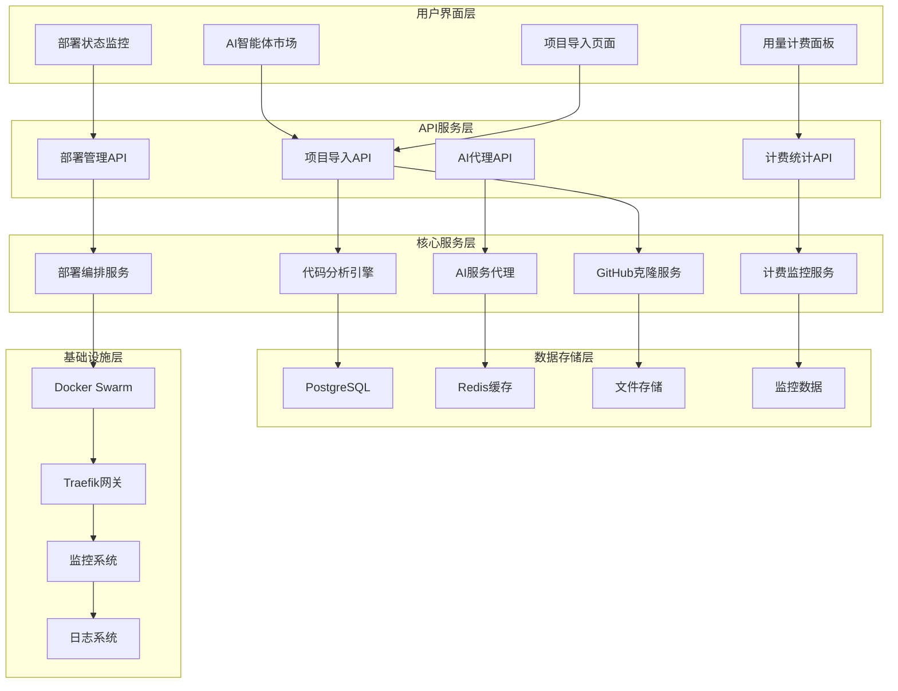

# GitHub代码一键部署开发修改方案

## 📋 方案概述

基于对现有Dokploy架构的深入分析，以及Claude 4、Gemini 2.5 Pro和Claude 4 MAX的技术方案综合评估，本方案提供了一套完整的GitHub代码一键转化为云应用的开发实施计划。

### 核心目标
- **分钟级部署**：从GitHub URL到可访问的云应用，完整流程控制在3-5分钟内
- **零配置体验**：用户只需提供GitHub URL，系统自动完成所有配置和部署
- **AI增强**：集成多AI提供商，提供智能代码分析和配置建议
- **透明计费**：精确的使用量统计和成本预测

## 🏗️ 架构设计

### 整体架构图



## 🔧 核心技术实现

### 1. 数据库架构扩展

基于Claude 4 MAX的修正建议，我们设计了高精度、高性能的数据库架构：

```sql
-- AI项目市场表
CREATE TABLE ai_marketplace_projects (
    id UUID PRIMARY KEY DEFAULT gen_random_uuid(),
    name VARCHAR(255) NOT NULL,
    description TEXT,
    github_url VARCHAR(255) NOT NULL UNIQUE,
    stars INTEGER DEFAULT 0,
    forks INTEGER DEFAULT 0,
    language VARCHAR(50),
    framework VARCHAR(100),
    category VARCHAR(100),
    tags TEXT[],
    logo_url VARCHAR(255),
    is_featured BOOLEAN DEFAULT FALSE,
    is_active BOOLEAN DEFAULT TRUE,
    created_at TIMESTAMP DEFAULT NOW(),
    updated_at TIMESTAMP DEFAULT NOW()
);

-- 用户部署项目表
CREATE TABLE user_deployed_projects (
    id UUID PRIMARY KEY DEFAULT gen_random_uuid(),
    user_id UUID REFERENCES users(id) NOT NULL,
    dokploy_application_id UUID REFERENCES applications(id) NOT NULL UNIQUE,
    github_url VARCHAR(255) NOT NULL,
    api_key VARCHAR(64) NOT NULL UNIQUE,
    analysis_cache JSONB,
    deployment_status VARCHAR(50) DEFAULT 'created',
    custom_domain VARCHAR(255),
    ssl_enabled BOOLEAN DEFAULT TRUE,
    last_accessed_at TIMESTAMP,
    created_at TIMESTAMP DEFAULT NOW(),
    updated_at TIMESTAMP DEFAULT NOW()
);

-- 用户AI凭证表（加密存储）
CREATE TABLE user_ai_credentials (
    id UUID PRIMARY KEY DEFAULT gen_random_uuid(),
    user_id UUID REFERENCES users(id) NOT NULL,
    provider VARCHAR(50) NOT NULL,
    encrypted_api_key TEXT NOT NULL,
    key_hash VARCHAR(64) NOT NULL,
    is_active BOOLEAN DEFAULT TRUE,
    created_at TIMESTAMP DEFAULT NOW(),
    last_used_at TIMESTAMP,
    UNIQUE(user_id, provider)
);

-- 精确计费记录表
CREATE TABLE billing_records (
    id UUID PRIMARY KEY DEFAULT gen_random_uuid(),
    user_id UUID REFERENCES users(id) NOT NULL,
    deployed_project_id UUID REFERENCES user_deployed_projects(id),
    service_type VARCHAR(50) NOT NULL,
    quantity DECIMAL(18,6) NOT NULL,
    unit_price DECIMAL(18,8) NOT NULL,
    total_cost DECIMAL(18,8) NOT NULL,
    currency VARCHAR(3) DEFAULT 'USD',
    metadata JSONB,
    recorded_at TIMESTAMP DEFAULT NOW()
);

-- API配额管理表
CREATE TABLE api_quotas (
    id UUID PRIMARY KEY DEFAULT gen_random_uuid(),
    user_id UUID REFERENCES users(id) NOT NULL,
    service_type VARCHAR(50) NOT NULL,
    daily_limit DECIMAL(18,6),
    monthly_limit DECIMAL(18,6),
    current_daily_usage DECIMAL(18,6) DEFAULT 0,
    current_monthly_usage DECIMAL(18,6) DEFAULT 0,
    reset_date TIMESTAMP NOT NULL,
    is_active BOOLEAN DEFAULT TRUE,
    UNIQUE(user_id, service_type)
);

-- 部署日志表
CREATE TABLE deployment_logs (
    id UUID PRIMARY KEY DEFAULT gen_random_uuid(),
    deployed_project_id UUID REFERENCES user_deployed_projects(id) NOT NULL,
    stage VARCHAR(50) NOT NULL,
    message TEXT,
    details JSONB,
    level VARCHAR(20) DEFAULT 'INFO',
    timestamp TIMESTAMP DEFAULT NOW()
);

-- 创建性能优化索引
CREATE INDEX idx_marketplace_category ON ai_marketplace_projects(category);
CREATE INDEX idx_marketplace_language ON ai_marketplace_projects(language);
CREATE INDEX idx_marketplace_stars ON ai_marketplace_projects(stars DESC);
CREATE INDEX idx_deployed_projects_user ON user_deployed_projects(user_id);
CREATE INDEX idx_deployed_projects_api_key ON user_deployed_projects(api_key);
CREATE INDEX idx_billing_user_time ON billing_records(user_id, recorded_at);
CREATE INDEX idx_billing_project ON billing_records(deployed_project_id);
CREATE INDEX idx_quota_user_service ON api_quotas(user_id, service_type);
```

### 2. 增强的代码分析引擎

```typescript
// packages/server/src/services/enhanced-code-analyzer.ts
import * as fs from 'fs/promises';
import * as path from 'path';
import { glob } from 'glob';
import { promisify } from 'util';
import { exec } from 'child_process';

const execAsync = promisify(exec);

export interface CodeAnalysisResult {
  // 基础信息
  detectedLanguage: string;
  detectedFramework: string;
  buildType: 'nixpacks' | 'dockerfile' | 'buildpacks';
  
  // 构建配置
  buildConfig: {
    startCommand?: string;
    buildCommand?: string;
    installCommand?: string;
    buildPath: string;
    port: number;
    packageManager?: string;
    runtimeVersion?: string;
  };
  
  // 环境配置
  environmentVariables: EnvironmentVariable[];
  requiredServices: ServiceRequirement[];
  
  // 资源需求
  resourceRequirements: {
    cpu: string;
    memory: string;
    storage: string;
    estimatedCost: number;
  };
  
  // 安全分析
  securityAnalysis: {
    vulnerabilities: SecurityVulnerability[];
    recommendations: string[];
    riskLevel: 'low' | 'medium' | 'high';
  };
  
  // 性能分析
  performanceAnalysis: {
    buildTime: number;
    bundleSize?: number;
    recommendations: string[];
  };
  
  // 可部署性评估
  deploymentReadiness: {
    score: number; // 0-100
    blockers: string[];
    warnings: string[];
    autoFixAvailable: boolean;
  };
}

interface EnvironmentVariable {
  name: string;
  description?: string;
  required: boolean;
  defaultValue?: string;
  sensitive: boolean;
  category: 'database' | 'api' | 'feature' | 'system';
}

interface ServiceRequirement {
  type: 'database' | 'cache' | 'storage' | 'external_api';
  service: string;
  version?: string;
  optional: boolean;
  autoProvision: boolean;
}

interface SecurityVulnerability {
  type: 'dependency' | 'configuration' | 'code';
  severity: 'low' | 'medium' | 'high' | 'critical';
  description: string;
  file?: string;
  line?: number;
  recommendation: string;
  autoFixAvailable: boolean;
}

export class EnhancedCodeAnalyzer {
  private readonly MAX_ANALYSIS_TIME = 180000; // 3分钟
  private readonly SUPPORTED_LANGUAGES = [
    'javascript', 'typescript', 'python', 'java', 'go', 'rust', 'php'
  ];

  async analyzeProject(repoPath: string): Promise<CodeAnalysisResult> {
    const startTime = Date.now();
    
    try {
      // 并行执行多种分析
      const [
        languageAnalysis,
        securityAnalysis,
        performanceAnalysis,
        deploymentAnalysis
      ] = await Promise.all([
        this.analyzeLanguageAndFramework(repoPath),
        this.performSecurityAnalysis(repoPath),
        this.analyzePerformance(repoPath),
        this.assessDeploymentReadiness(repoPath)
      ]);

      const result: CodeAnalysisResult = {
        ...languageAnalysis,
        securityAnalysis,
        performanceAnalysis,
        deploymentReadiness: deploymentAnalysis,
      };

      // 记录分析时间
      result.performanceAnalysis.buildTime = Date.now() - startTime;

      return result;
    } catch (error) {
      throw new Error(`Code analysis failed: ${error.message}`);
    }
  }

  private async analyzeLanguageAndFramework(repoPath: string): Promise<Partial<CodeAnalysisResult>> {
    // 检查Dockerfile
    const dockerfilePath = path.join(repoPath, 'Dockerfile');
    if (await this.fileExists(dockerfilePath)) {
      return await this.analyzeDockerProject(dockerfilePath);
    }

    // 检查各种语言项目
    const analyzers = [
      { files: ['package.json'], analyzer: this.analyzeNodeProject },
      { files: ['requirements.txt', 'setup.py', 'pyproject.toml'], analyzer: this.analyzePythonProject },
      { files: ['pom.xml', 'build.gradle'], analyzer: this.analyzeJavaProject },
      { files: ['go.mod', 'go.sum'], analyzer: this.analyzeGoProject },
      { files: ['Cargo.toml'], analyzer: this.analyzeRustProject },
      { files: ['composer.json'], analyzer: this.analyzePHPProject },
    ];

    for (const { files, analyzer } of analyzers) {
      for (const file of files) {
        if (await this.fileExists(path.join(repoPath, file))) {
          return await analyzer.call(this, repoPath);
        }
      }
    }

    throw new Error('Unsupported project type');
  }

  private async analyzeNodeProject(repoPath: string): Promise<Partial<CodeAnalysisResult>> {
    const packageJsonPath = path.join(repoPath, 'package.json');
    const packageJson = JSON.parse(await fs.readFile(packageJsonPath, 'utf-8'));
    
    const dependencies = { ...packageJson.dependencies, ...packageJson.devDependencies };
    const framework = this.detectNodeFramework(dependencies);
    const packageManager = await this.detectPackageManager(repoPath);
    
    // 检测TypeScript
    const hasTypeScript = dependencies.typescript || 
                         await this.fileExists(path.join(repoPath, 'tsconfig.json'));
    
    // 检测环境变量
    const envVars = await this.extractEnvironmentVariables(repoPath);
    
    // 检测所需服务
    const requiredServices = await this.detectRequiredServices(dependencies);
    
    return {
      detectedLanguage: hasTypeScript ? 'typescript' : 'javascript',
      detectedFramework: framework,
      buildType: 'nixpacks',
      buildConfig: {
        startCommand: packageJson.scripts?.start || 'npm start',
        buildCommand: packageJson.scripts?.build,
        installCommand: `${packageManager} install`,
        buildPath: '/',
        port: await this.detectPort(repoPath, 3000),
        packageManager,
        runtimeVersion: packageJson.engines?.node || '18',
      },
      environmentVariables: envVars,
      requiredServices,
      resourceRequirements: this.estimateResourceRequirements(framework, dependencies),
    };
  }

  private async analyzePythonProject(repoPath: string): Promise<Partial<CodeAnalysisResult>> {
    const framework = await this.detectPythonFramework(repoPath);
    const pythonVersion = await this.detectPythonVersion(repoPath);
    const envVars = await this.extractEnvironmentVariables(repoPath);
    const requiredServices = await this.detectPythonServices(repoPath);
    
    return {
      detectedLanguage: 'python',
      detectedFramework: framework,
      buildType: 'nixpacks',
      buildConfig: {
        startCommand: this.getPythonStartCommand(framework),
        buildPath: '/',
        port: this.getPythonDefaultPort(framework),
        runtimeVersion: pythonVersion,
      },
      environmentVariables: envVars,
      requiredServices,
      resourceRequirements: this.estimateResourceRequirements(framework, {}),
    };
  }

  private async performSecurityAnalysis(repoPath: string): Promise<any> {
    const vulnerabilities: SecurityVulnerability[] = [];
    const recommendations: string[] = [];
    
    // 扫描敏感信息
    await this.scanForSecrets(repoPath, vulnerabilities);
    
    // 检查依赖漏洞
    await this.checkDependencyVulnerabilities(repoPath, vulnerabilities);
    
    // 检查配置安全
    await this.checkSecurityConfigurations(repoPath, vulnerabilities, recommendations);
    
    // 评估风险等级
    const riskLevel = this.calculateRiskLevel(vulnerabilities);
    
    return {
      vulnerabilities,
      recommendations,
      riskLevel,
    };
  }

  private async analyzePerformance(repoPath: string): Promise<any> {
    const recommendations: string[] = [];
    let bundleSize: number | undefined;
    
    // 分析构建输出大小
    bundleSize = await this.estimateBundleSize(repoPath);
    
    // 检查性能优化机会
    await this.checkPerformanceOptimizations(repoPath, recommendations);
    
    return {
      buildTime: 0, // 将在主函数中设置
      bundleSize,
      recommendations,
    };
  }

  private async assessDeploymentReadiness(repoPath: string): Promise<any> {
    const blockers: string[] = [];
    const warnings: string[] = [];
    let score = 100;
    
    // 检查必需文件
    const requiredFiles = await this.checkRequiredFiles(repoPath);
    if (requiredFiles.missing.length > 0) {
      blockers.push(`Missing required files: ${requiredFiles.missing.join(', ')}`);
      score -= 30;
    }
    
    // 检查环境配置
    const envCheck = await this.checkEnvironmentConfiguration(repoPath);
    if (envCheck.issues.length > 0) {
      warnings.push(...envCheck.issues);
      score -= 10;
    }
    
    // 检查构建配置
    const buildCheck = await this.checkBuildConfiguration(repoPath);
    if (buildCheck.issues.length > 0) {
      if (buildCheck.critical) {
        blockers.push(...buildCheck.issues);
        score -= 40;
      } else {
        warnings.push(...buildCheck.issues);
        score -= 20;
      }
    }
    
    return {
      score: Math.max(0, score),
      blockers,
      warnings,
      autoFixAvailable: blockers.length === 0 && warnings.length < 3,
    };
  }

  // 工具方法
  private async fileExists(filePath: string): Promise<boolean> {
    try {
      await fs.access(filePath);
      return true;
    } catch {
      return false;
    }
  }

  private detectNodeFramework(dependencies: Record<string, string>): string {
    const frameworks = [
      { deps: ['next'], name: 'Next.js', priority: 1 },
      { deps: ['@nuxt/core', 'nuxt'], name: 'Nuxt.js', priority: 1 },
      { deps: ['@sveltejs/kit'], name: 'SvelteKit', priority: 1 },
      { deps: ['@remix-run/react'], name: 'Remix', priority: 1 },
      { deps: ['@angular/core'], name: 'Angular', priority: 2 },
      { deps: ['react'], name: 'React', priority: 3 },
      { deps: ['vue'], name: 'Vue.js', priority: 3 },
      { deps: ['express'], name: 'Express', priority: 4 },
      { deps: ['fastify'], name: 'Fastify', priority: 4 },
      { deps: ['koa'], name: 'Koa', priority: 4 },
    ];

    const detected = frameworks
      .filter(({ deps }) => deps.some(dep => dependencies[dep]))
      .sort((a, b) => a.priority - b.priority);

    return detected[0]?.name || 'Node.js';
  }

  private async detectPythonFramework(repoPath: string): Promise<string> {
    const frameworks = [
      { files: ['manage.py'], imports: ['django'], name: 'Django' },
      { files: ['app.py'], imports: ['flask'], name: 'Flask' },
      { files: ['main.py'], imports: ['fastapi'], name: 'FastAPI' },
      { files: ['app.py'], imports: ['streamlit'], name: 'Streamlit' },
      { files: ['app.py'], imports: ['gradio'], name: 'Gradio' },
    ];

    for (const { files, imports, name } of frameworks) {
      for (const file of files) {
        if (await this.fileExists(path.join(repoPath, file))) {
          // 检查文件中是否包含相关导入
          const content = await fs.readFile(path.join(repoPath, file), 'utf-8');
          if (imports.some(imp => content.includes(imp))) {
            return name;
          }
        }
      }
    }

    return 'Python';
  }

  private async extractEnvironmentVariables(repoPath: string): Promise<EnvironmentVariable[]> {
    const envVars: EnvironmentVariable[] = [];
    const envFiles = ['.env', '.env.example', '.env.local', '.env.development'];
    
    for (const envFile of envFiles) {
      const envPath = path.join(repoPath, envFile);
      if (await this.fileExists(envPath)) {
        const content = await fs.readFile(envPath, 'utf-8');
        const parsed = this.parseEnvFile(content);
        envVars.push(...parsed);
      }
    }

    return this.deduplicateEnvVars(envVars);
  }

  private parseEnvFile(content: string): EnvironmentVariable[] {
    const vars: EnvironmentVariable[] = [];
    const lines = content.split('\n');
    
    for (const line of lines) {
      const trimmed = line.trim();
      if (trimmed && !trimmed.startsWith('#')) {
        const [key, value] = trimmed.split('=', 2);
        if (key) {
          vars.push({
            name: key.trim(),
            defaultValue: value?.trim(),
            required: !value || value.trim() === '',
            sensitive: this.isSensitiveVar(key.trim()),
            category: this.categorizeEnvVar(key.trim()),
          });
        }
      }
    }
    
    return vars;
  }

  private isSensitiveVar(name: string): boolean {
    const sensitivePatterns = [
      /password/i, /secret/i, /key/i, /token/i, /auth/i, /api/i, /private/i
    ];
    return sensitivePatterns.some(pattern => pattern.test(name));
  }

  private categorizeEnvVar(name: string): EnvironmentVariable['category'] {
    if (/database|db|postgres|mysql|mongo/i.test(name)) return 'database';
    if (/api|token|key|secret/i.test(name)) return 'api';
    if (/feature|enable|disable|flag/i.test(name)) return 'feature';
    return 'system';
  }

  private estimateResourceRequirements(framework: string, dependencies: Record<string, string>): any {
    const baseRequirements = {
      'Next.js': { cpu: '0.5', memory: '512Mi', storage: '1Gi', cost: 0.02 },
      'React': { cpu: '0.2', memory: '256Mi', storage: '512Mi', cost: 0.01 },
      'Vue.js': { cpu: '0.2', memory: '256Mi', storage: '512Mi', cost: 0.01 },
      'Express': { cpu: '0.3', memory: '256Mi', storage: '512Mi', cost: 0.015 },
      'Django': { cpu: '0.5', memory: '512Mi', storage: '1Gi', cost: 0.02 },
      'Flask': { cpu: '0.3', memory: '256Mi', storage: '512Mi', cost: 0.015 },
      'FastAPI': { cpu: '0.4', memory: '512Mi', storage: '1Gi', cost: 0.018 },
      'Spring Boot': { cpu: '0.8', memory: '1Gi', storage: '2Gi', cost: 0.04 },
    };

    const base = baseRequirements[framework] || baseRequirements['Express'];
    
    // 根据依赖调整资源需求
    let multiplier = 1;
    const heavyDeps = ['tensorflow', 'pytorch', 'pandas', 'numpy', 'opencv'];
    if (Object.keys(dependencies).some(dep => heavyDeps.includes(dep))) {
      multiplier = 2;
    }

    return {
      cpu: base.cpu,
      memory: base.memory,
      storage: base.storage,
      estimatedCost: base.cost * multiplier,
    };
  }
}
```

### 3. 项目导入服务

```typescript
// packages/server/src/services/project-ingestion.ts
import { GithubService } from './github';
import { EnhancedCodeAnalyzer } from './enhanced-code-analyzer';
import { ApplicationService } from './application';
import { db } from '../db';
import { userDeployedProjects, aiMarketplaceProjects } from '../db/schema';
import { randomBytes, createHash } from 'crypto';
import * as fs from 'fs/promises';
import * as path from 'path';

export interface ProjectIngestionOptions {
  autoStart?: boolean;
  customDomain?: string;
  environmentOverrides?: Record<string, string>;
  resourceOverrides?: {
    cpu?: string;
    memory?: string;
    storage?: string;
  };
}

export class ProjectIngestionService {
  constructor(
    private githubService: GithubService,
    private codeAnalyzer: EnhancedCodeAnalyzer,
    private applicationService: ApplicationService
  ) {}

  async ingestFromGithub(
    userId: string,
    githubUrl: string,
    projectId: string,
    options: ProjectIngestionOptions = {}
  ): Promise<{
    application: any;
    analysisResult: any;
    apiKey: string;
    deploymentUrl?: string;
  }> {
    const ingestionId = randomBytes(16).toString('hex');
    let repoPath: string | undefined;
    let createdAppId: string | undefined;

    try {
      // 1. 验证GitHub URL
      await this.validateGithubUrl(githubUrl);

      // 2. 克隆仓库
      repoPath = await this.githubService.cloneRepository(githubUrl);

      // 3. 代码分析
      const analysisResult = await this.codeAnalyzer.analyzeProject(repoPath);

      // 4. 检查部署就绪性
      if (analysisResult.deploymentReadiness.score < 70) {
        throw new Error(
          `Project readiness score too low (${analysisResult.deploymentReadiness.score}%). ` +
          `Blockers: ${analysisResult.deploymentReadiness.blockers.join(', ')}`
        );
      }

      // 5. 创建应用配置
      const appConfig = this.buildApplicationConfig(
        githubUrl,
        analysisResult,
        projectId,
        options
      );

      // 6. 创建Dokploy应用
      const application = await this.applicationService.createApplication(
        appConfig,
        userId
      );
      createdAppId = application.id;

      // 7. 生成API密钥
      const apiKey = this.generateApiKey();

      // 8. 保存源代码
      await this.saveSourceCode(repoPath, application.id);

      // 9. 记录部署项目
      await db.insert(userDeployedProjects).values({
        userId,
        dokployApplicationId: application.id,
        githubUrl,
        apiKey: this.hashApiKey(apiKey),
        analysisCache: analysisResult,
        deploymentStatus: 'ready',
        customDomain: options.customDomain,
      });

      // 10. 自动启动部署
      let deploymentUrl: string | undefined;
      if (options.autoStart) {
        deploymentUrl = await this.startDeployment(application.id, userId);
      }

      return {
        application,
        analysisResult,
        apiKey,
        deploymentUrl,
      };

    } catch (error) {
      // 回滚
      await this.rollbackIngestion(createdAppId);
      throw error;
    } finally {
      // 清理临时文件
      if (repoPath) {
        await fs.rm(repoPath, { recursive: true, force: true }).catch(console.warn);
      }
    }
  }

  private async validateGithubUrl(githubUrl: string): Promise<void> {
    const urlPattern = /^https:\/\/github\.com\/[\w-]+\/[\w-]+(?:\.git)?$/;
    if (!urlPattern.test(githubUrl)) {
      throw new Error('Invalid GitHub URL format');
    }

    // 检查仓库访问权限
    const repoPath = githubUrl.replace('https://github.com/', '').replace('.git', '');
    const response = await fetch(`https://api.github.com/repos/${repoPath}`);
    
    if (!response.ok) {
      throw new Error(`Repository not accessible: ${response.status}`);
    }

    const repoData = await response.json();
    if (repoData.size > 500000) { // 500MB limit
      throw new Error('Repository too large');
    }
  }

  private buildApplicationConfig(
    githubUrl: string,
    analysis: any,
    projectId: string,
    options: ProjectIngestionOptions
  ): any {
    const repoName = githubUrl.split('/').pop()?.replace('.git', '') || 'app';
    
    return {
      name: repoName,
      description: `Imported from ${githubUrl}`,
      buildType: analysis.buildType,
      port: analysis.buildConfig.port,
      startCommand: analysis.buildConfig.startCommand,
      buildCommand: analysis.buildConfig.buildCommand,
      installCommand: analysis.buildConfig.installCommand,
      env: this.buildEnvironmentVariables(analysis.environmentVariables, options.environmentOverrides),
      cpus: options.resourceOverrides?.cpu || analysis.resourceRequirements.cpu,
      memory: options.resourceOverrides?.memory || analysis.resourceRequirements.memory,
      projectId,
      // 标记为导入的应用
      sourceType: 'github-import',
      metadata: {
        githubUrl,
        analysisResult: analysis,
        importedAt: new Date().toISOString(),
      },
    };
  }

  private buildEnvironmentVariables(
    envVars: any[],
    overrides?: Record<string, string>
  ): Record<string, string> {
    const result: Record<string, string> = {};
    
    // 添加分析发现的环境变量
    envVars.forEach(envVar => {
      if (envVar.defaultValue && !envVar.sensitive) {
        result[envVar.name] = envVar.defaultValue;
      }
    });

    // 应用用户覆盖
    if (overrides) {
      Object.assign(result, overrides);
    }

    return result;
  }

  private generateApiKey(): string {
    return 'gta_' + randomBytes(32).toString('hex');
  }

  private hashApiKey(apiKey: string): string {
    return createHash('sha256').update(apiKey).digest('hex');
  }

  private async saveSourceCode(repoPath: string, applicationId: string): Promise<void> {
    const destPath = `/dokploy/sources/${applicationId}`;
    await fs.mkdir(destPath, { recursive: true });
    await fs.cp(repoPath, destPath, { recursive: true });
  }

  private async startDeployment(applicationId: string, userId: string): Promise<string> {
    const deployment = await this.applicationService.createDeployment(applicationId, userId);
    
    // 返回部署URL（需要等待部署完成）
    return `https://${applicationId}.yourdomain.com`;
  }

  private async rollbackIngestion(applicationId?: string): Promise<void> {
    if (applicationId) {
      try {
        await this.applicationService.deleteApplication(applicationId);
        await db.delete(userDeployedProjects)
          .where(eq(userDeployedProjects.dokployApplicationId, applicationId));
      } catch (error) {
        console.error('Rollback failed:', error);
      }
    }
  }
}
```

### 4. AI代理服务

```typescript
// packages/server/src/services/ai-proxy.ts
import { db } from '../db';
import { userAiCredentials, userDeployedProjects, billingRecords } from '../db/schema';
import { eq, and } from 'drizzle-orm';
import { createCipheriv, createDecipheriv, scryptSync, randomBytes } from 'crypto';
import { auditLogger } from '../utils/audit-logger';
import { RateLimiter } from '../utils/rate-limiter';

export class AIProxyService {
  private readonly rateLimiter = new RateLimiter();
  private readonly encryptionKey = scryptSync(process.env.AI_ENCRYPTION_KEY!, 'salt', 32);

  async proxyRequest(
    apiKey: string,
    provider: string,
    payload: any,
    clientInfo: { ip: string; userAgent: string }
  ): Promise<any> {
    const requestId = randomBytes(16).toString('hex');
    const startTime = Date.now();

    try {
      // 1. 验证API密钥
      const project = await this.validateApiKey(apiKey);
      
      // 2. 检查速率限制
      await this.checkRateLimit(project.userId);
      
      // 3. 获取用户AI凭证
      const userApiKey = await this.getUserApiKey(project.userId, provider);
      
      // 4. 转发请求
      const response = await this.forwardRequest(userApiKey, provider, payload);
      
      // 5. 记录使用量
      await this.recordUsage(project, provider, payload, response);
      
      // 6. 记录审计日志
      await auditLogger.log('AI_PROXY_SUCCESS', {
        requestId,
        userId: project.userId,
        provider,
        tokens: response.usage?.total_tokens || 0,
        duration: Date.now() - startTime,
      });

      return response;

    } catch (error) {
      await auditLogger.log('AI_PROXY_ERROR', {
        requestId,
        error: error.message,
        clientInfo,
      });
      throw error;
    }
  }

  private async validateApiKey(apiKey: string): Promise<any> {
    const hashedKey = require('crypto').createHash('sha256').update(apiKey).digest('hex');
    
    const project = await db.query.userDeployedProjects.findFirst({
      where: eq(userDeployedProjects.apiKey, hashedKey),
    });

    if (!project) {
      throw new Error('Invalid API key');
    }

    return project;
  }

  private async checkRateLimit(userId: string): Promise<void> {
    const key = `ai_proxy:${userId}`;
    const allowed = await this.rateLimiter.isAllowed(key, 1000, 3600); // 1000/hour
    
    if (!allowed) {
      throw new Error('Rate limit exceeded');
    }
  }

  private async getUserApiKey(userId: string, provider: string): Promise<string> {
    const creds = await db.query.userAiCredentials.findFirst({
      where: and(
        eq(userAiCredentials.userId, userId),
        eq(userAiCredentials.provider, provider),
        eq(userAiCredentials.isActive, true)
      ),
    });

    if (!creds) {
      throw new Error(`No ${provider} credentials configured`);
    }

    return this.decrypt(creds.encryptedApiKey);
  }

  private async forwardRequest(apiKey: string, provider: string, payload: any): Promise<any> {
    const endpoints = {
      openai: 'https://api.openai.com/v1/chat/completions',
      anthropic: 'https://api.anthropic.com/v1/messages',
      cohere: 'https://api.cohere.ai/v1/generate',
    };

    const endpoint = endpoints[provider];
    if (!endpoint) {
      throw new Error(`Unsupported provider: ${provider}`);
    }

    const response = await fetch(endpoint, {
      method: 'POST',
      headers: {
        'Authorization': `Bearer ${apiKey}`,
        'Content-Type': 'application/json',
      },
      body: JSON.stringify(payload),
    });

    if (!response.ok) {
      throw new Error(`AI service error: ${response.status}`);
    }

    return await response.json();
  }

  private async recordUsage(
    project: any,
    provider: string,
    payload: any,
    response: any
  ): Promise<void> {
    const usage = response.usage;
    if (!usage) return;

    const pricing = this.getPricing(provider, payload.model);
    const inputCost = (usage.prompt_tokens / 1000) * pricing.input;
    const outputCost = (usage.completion_tokens / 1000) * pricing.output;

    await db.insert(billingRecords).values([
      {
        userId: project.userId,
        deployedProjectId: project.id,
        serviceType: 'AI_TOKENS_INPUT',
        quantity: usage.prompt_tokens.toString(),
        unitPrice: pricing.input.toString(),
        totalCost: inputCost.toString(),
        metadata: { model: payload.model, provider },
      },
      {
        userId: project.userId,
        deployedProjectId: project.id,
        serviceType: 'AI_TOKENS_OUTPUT',
        quantity: usage.completion_tokens.toString(),
        unitPrice: pricing.output.toString(),
        totalCost: outputCost.toString(),
        metadata: { model: payload.model, provider },
      },
    ]);
  }

  private encrypt(text: string): string {
    const iv = randomBytes(16);
    const cipher = createCipheriv('aes-256-cbc', this.encryptionKey, iv);
    let encrypted = cipher.update(text, 'utf8', 'hex');
    encrypted += cipher.final('hex');
    return iv.toString('hex') + ':' + encrypted;
  }

  private decrypt(encryptedText: string): string {
    const [ivHex, encrypted] = encryptedText.split(':');
    const iv = Buffer.from(ivHex, 'hex');
    const decipher = createDecipheriv('aes-256-cbc', this.encryptionKey, iv);
    let decrypted = decipher.update(encrypted, 'hex', 'utf8');
    decrypted += decipher.final('utf8');
    return decrypted;
  }

  private getPricing(provider: string, model: string): { input: number; output: number } {
    const pricing = {
      openai: {
        'gpt-4': { input: 0.03, output: 0.06 },
        'gpt-3.5-turbo': { input: 0.001, output: 0.002 },
      },
      anthropic: {
        'claude-3-opus': { input: 0.015, output: 0.075 },
        'claude-3-sonnet': { input: 0.003, output: 0.015 },
      },
      cohere: {
        'command': { input: 0.001, output: 0.002 },
      },
    };

    return pricing[provider]?.[model] || { input: 0.001, output: 0.002 };
  }
}
```

## 📱 前端实现

### 1. AI智能体市场页面

```tsx
// apps/dokploy/pages/marketplace/index.tsx
import React, { useState, useEffect } from 'react';
import { Card, CardContent, CardHeader, CardTitle } from '@/components/ui/card';
import { Badge } from '@/components/ui/badge';
import { Button } from '@/components/ui/button';
import { Input } from '@/components/ui/input';
import { Select, SelectContent, SelectItem, SelectTrigger, SelectValue } from '@/components/ui/select';
import { Star, GitFork, Zap, Search, Filter } from 'lucide-react';
import { api } from '@/utils/api';

interface MarketplaceProject {
  id: string;
  name: string;
  description: string;
  githubUrl: string;
  stars: number;
  forks: number;
  language: string;
  framework: string;
  category: string;
  tags: string[];
  logoUrl?: string;
  isFeatured: boolean;
}

export default function MarketplacePage() {
  const [projects, setProjects] = useState<MarketplaceProject[]>([]);
  const [searchTerm, setSearchTerm] = useState('');
  const [selectedCategory, setSelectedCategory] = useState<string>('all');
  const [selectedLanguage, setSelectedLanguage] = useState<string>('all');
  const [loading, setLoading] = useState(true);

  const { data: marketplaceData, isLoading } = api.marketplace.getProjects.useQuery({
    category: selectedCategory !== 'all' ? selectedCategory : undefined,
    language: selectedLanguage !== 'all' ? selectedLanguage : undefined,
    search: searchTerm || undefined,
  });

  const deployMutation = api.project.deployFromMarketplace.useMutation();

  useEffect(() => {
    if (marketplaceData) {
      setProjects(marketplaceData);
      setLoading(false);
    }
  }, [marketplaceData]);

  const handleDeploy = async (project: MarketplaceProject) => {
    try {
      const result = await deployMutation.mutateAsync({
        githubUrl: project.githubUrl,
        projectId: 'default-project-id', // 用户选择的项目ID
      });
      
      // 跳转到部署状态页面
      window.location.href = `/dashboard/project/${result.projectId}/services/application/${result.applicationId}`;
    } catch (error) {
      console.error('Deployment failed:', error);
    }
  };

  const categories = [
    { value: 'all', label: 'All Categories' },
    { value: 'chatbot', label: 'Chatbots' },
    { value: 'productivity', label: 'Productivity' },
    { value: 'ecommerce', label: 'E-commerce' },
    { value: 'analytics', label: 'Analytics' },
    { value: 'social', label: 'Social' },
  ];

  const languages = [
    { value: 'all', label: 'All Languages' },
    { value: 'javascript', label: 'JavaScript' },
    { value: 'typescript', label: 'TypeScript' },
    { value: 'python', label: 'Python' },
    { value: 'java', label: 'Java' },
    { value: 'go', label: 'Go' },
  ];

  const filteredProjects = projects.filter(project => {
    const matchesSearch = project.name.toLowerCase().includes(searchTerm.toLowerCase()) ||
                         project.description.toLowerCase().includes(searchTerm.toLowerCase());
    const matchesCategory = selectedCategory === 'all' || project.category === selectedCategory;
    const matchesLanguage = selectedLanguage === 'all' || project.language === selectedLanguage;
    
    return matchesSearch && matchesCategory && matchesLanguage;
  });

  return (
    <div className="container mx-auto px-4 py-8">
      {/* Header */}
      <div className="mb-8">
        <h1 className="text-4xl font-bold mb-2">AI智能体市场</h1>
        <p className="text-gray-600 text-lg">
          一键部署热门开源AI项目，快速搭建您的专属智能应用
        </p>
      </div>

      {/* Featured Projects */}
      <div className="mb-8">
        <h2 className="text-2xl font-semibold mb-4">🔥 精选项目</h2>
        <div className="grid grid-cols-1 md:grid-cols-2 lg:grid-cols-3 gap-6">
          {projects.filter(p => p.isFeatured).slice(0, 3).map((project) => (
            <FeaturedProjectCard key={project.id} project={project} onDeploy={handleDeploy} />
          ))}
        </div>
      </div>

      {/* Search and Filters */}
      <div className="mb-6 flex flex-col sm:flex-row gap-4">
        <div className="relative flex-1">
          <Search className="absolute left-3 top-3 h-4 w-4 text-gray-400" />
          <Input
            placeholder="搜索项目..."
            value={searchTerm}
            onChange={(e) => setSearchTerm(e.target.value)}
            className="pl-10"
          />
        </div>
        
        <Select value={selectedCategory} onValueChange={setSelectedCategory}>
          <SelectTrigger className="w-48">
            <SelectValue placeholder="选择分类" />
          </SelectTrigger>
          <SelectContent>
            {categories.map((category) => (
              <SelectItem key={category.value} value={category.value}>
                {category.label}
              </SelectItem>
            ))}
          </SelectContent>
        </Select>

        <Select value={selectedLanguage} onValueChange={setSelectedLanguage}>
          <SelectTrigger className="w-48">
            <SelectValue placeholder="选择语言" />
          </SelectTrigger>
          <SelectContent>
            {languages.map((language) => (
              <SelectItem key={language.value} value={language.value}>
                {language.label}
              </SelectItem>
            ))}
          </SelectContent>
        </Select>
      </div>

      {/* Project Grid */}
      <div className="grid grid-cols-1 md:grid-cols-2 lg:grid-cols-3 xl:grid-cols-4 gap-6">
        {filteredProjects.map((project) => (
          <ProjectCard key={project.id} project={project} onDeploy={handleDeploy} />
        ))}
      </div>

      {/* Loading State */}
      {isLoading && (
        <div className="grid grid-cols-1 md:grid-cols-2 lg:grid-cols-3 xl:grid-cols-4 gap-6">
          {[...Array(8)].map((_, i) => (
            <div key={i} className="animate-pulse">
              <Card>
                <CardHeader>
                  <div className="h-4 bg-gray-200 rounded w-3/4"></div>
                  <div className="h-3 bg-gray-200 rounded w-1/2"></div>
                </CardHeader>
                <CardContent>
                  <div className="h-20 bg-gray-200 rounded"></div>
                </CardContent>
              </Card>
            </div>
          ))}
        </div>
      )}
    </div>
  );
}

function FeaturedProjectCard({ project, onDeploy }: { project: MarketplaceProject; onDeploy: (project: MarketplaceProject) => void }) {
  return (
    <Card className="border-2 border-blue-200 shadow-lg">
      <CardHeader className="pb-3">
        <div className="flex items-center justify-between">
          <div className="flex items-center gap-2">
            {project.logoUrl && (
              
            )}
            <CardTitle className="text-lg">{project.name}</CardTitle>
          </div>
          <Badge variant="secondary" className="bg-blue-100 text-blue-800">
            精选
          </Badge>
        </div>
        <p className="text-sm text-gray-600 line-clamp-2">{project.description}</p>
      </CardHeader>
      
      <CardContent className="pt-0">
        <div className="flex items-center gap-4 mb-3 text-sm text-gray-500">
          <div className="flex items-center gap-1">
            <Star className="w-4 h-4" />
            <span>{project.stars.toLocaleString()}</span>
          </div>
          <div className="flex items-center gap-1">
            <GitFork className="w-4 h-4" />
            <span>{project.forks.toLocaleString()}</span>
          </div>
        </div>

        <div className="flex flex-wrap gap-1 mb-4">
          <Badge variant="outline">{project.language}</Badge>
          <Badge variant="outline">{project.framework}</Badge>
          {project.tags.slice(0, 2).map((tag) => (
            <Badge key={tag} variant="outline" className="text-xs">
              {tag}
            </Badge>
          ))}
        </div>

        <div className="flex gap-2">
          <Button
            variant="outline"
            size="sm"
            className="flex-1"
            onClick={() => window.open(project.githubUrl, '_blank')}
          >
            查看代码
          </Button>
          <Button
            size="sm"
            className="flex-1"
            onClick={() => onDeploy(project)}
          >
            <Zap className="w-4 h-4 mr-1" />
            一键部署
          </Button>
        </div>
      </CardContent>
    </Card>
  );
}

function ProjectCard({ project, onDeploy }: { project: MarketplaceProject; onDeploy: (project: MarketplaceProject) => void }) {
  return (
    <Card className="hover:shadow-lg transition-shadow">
      <CardHeader className="pb-3">
        <div className="flex items-center justify-between">
          <CardTitle className="text-lg">{project.name}</CardTitle>
          <Badge variant="secondary">{project.category}</Badge>
        </div>
        <p className="text-sm text-gray-600 line-clamp-2">{project.description}</p>
      </CardHeader>
      
      <CardContent className="pt-0">
        <div className="flex items-center gap-4 mb-3 text-sm text-gray-500">
          <div className="flex items-center gap-1">
            <Star className="w-4 h-4" />
            <span>{project.stars.toLocaleString()}</span>
          </div>
          <div className="flex items-center gap-1">
            <GitFork className="w-4 h-4" />
            <span>{project.forks.toLocaleString()}</span>
          </div>
        </div>

        <div className="flex flex-wrap gap-1 mb-4">
          <Badge variant="outline">{project.language}</Badge>
          <Badge variant="outline">{project.framework}</Badge>
        </div>

        <div className="flex gap-2">
          <Button
            variant="outline"
            size="sm"
            className="flex-1"
            onClick={() => window.open(project.githubUrl, '_blank')}
          >
            查看代码
          </Button>
          <Button
            size="sm"
            className="flex-1"
            onClick={() => onDeploy(project)}
          >
            部署
          </Button>
        </div>
      </CardContent>
    </Card>
  );
}
```

### 2. 项目导入页面

```tsx
// apps/dokploy/pages/dashboard/project/[projectId]/import.tsx
import React, { useState } from 'react';
import { Card, CardContent, CardHeader, CardTitle } from '@/components/ui/card';
import { Button } from '@/components/ui/button';
import { Input } from '@/components/ui/input';
import { Label } from '@/components/ui/label';
import { Switch } from '@/components/ui/switch';
import { Textarea } from '@/components/ui/textarea';
import { Alert, AlertDescription } from '@/components/ui/alert';
import { Badge } from '@/components/ui/badge';
import { Github, AlertCircle, CheckCircle, Clock, Zap } from 'lucide-react';
import { api } from '@/utils/api';
import { useRouter } from 'next/router';

interface ImportFormData {
  githubUrl: string;
  autoStart: boolean;
  customDomain: string;
  environmentOverrides: Record<string, string>;
}

export default function ImportPage() {
  const router = useRouter();
  const { projectId } = router.query as { projectId: string };
  
  const [formData, setFormData] = useState<ImportFormData>({
    githubUrl: '',
    autoStart: true,
    customDomain: '',
    environmentOverrides: {},
  });
  
  const [analysisResult, setAnalysisResult] = useState<any>(null);
  const [importing, setImporting] = useState(false);
  const [step, setStep] = useState<'input' | 'analyzing' | 'configuring' | 'deploying' | 'complete'>('input');

  const importMutation = api.project.importFromGithub.useMutation();

  const handleSubmit = async (e: React.FormEvent) => {
    e.preventDefault();
    setImporting(true);
    setStep('analyzing');

    try {
      const result = await importMutation.mutateAsync({
        githubUrl: formData.githubUrl,
        projectId,
        options: {
          autoStart: formData.autoStart,
          customDomain: formData.customDomain || undefined,
          environmentOverrides: formData.environmentOverrides,
        },
      });

      setAnalysisResult(result.analysisResult);
      setStep(formData.autoStart ? 'deploying' : 'complete');
      
      if (formData.autoStart) {
        // 等待部署完成
        setTimeout(() => {
          setStep('complete');
        }, 30000); // 30秒后认为部署完成
      }

    } catch (error) {
      console.error('Import failed:', error);
      setStep('input');
    } finally {
      setImporting(false);
    }
  };

  const handleUrlChange = (url: string) => {
    setFormData(prev => ({ ...prev, githubUrl: url }));
    
    // 自动提取仓库名作为自定义域名建议
    if (url) {
      const match = url.match(/github\.com\/[\w-]+\/([\w-]+)/);
      if (match) {
        setFormData(prev => ({ ...prev, customDomain: match[1] }));
      }
    }
  };

  if (step === 'analyzing') {
    return <AnalyzingStep />;
  }

  if (step === 'deploying') {
    return <DeployingStep analysisResult={analysisResult} />;
  }

  if (step === 'complete') {
    return <CompleteStep analysisResult={analysisResult} />;
  }

  return (
    <div className="container mx-auto px-4 py-8 max-w-4xl">
      <div className="mb-8">
        <h1 className="text-3xl font-bold mb-2">导入GitHub项目</h1>
        <p className="text-gray-600">
          从GitHub仓库一键部署您的应用，支持自动分析和智能配置
        </p>
      </div>

      <form onSubmit={handleSubmit} className="space-y-6">
        {/* GitHub URL 输入 */}
        <Card>
          <CardHeader>
            <CardTitle className="flex items-center gap-2">
              <Github className="w-5 h-5" />
              GitHub仓库
            </CardTitle>
          </CardHeader>
          <CardContent>
            <div className="space-y-4">
              <div>
                <Label htmlFor="githubUrl">仓库URL</Label>
                <Input
                  id="githubUrl"
                  type="url"
                  placeholder="https://github.com/username/repository"
                  value={formData.githubUrl}
                  onChange={(e) => handleUrlChange(e.target.value)}
                  required
                />
                <p className="text-sm text-gray-500 mt-1">
                  请确保仓库是公开的，或者您有访问权限
                </p>
              </div>

              <div className="flex items-center space-x-2">
                <Switch
                  id="autoStart"
                  checked={formData.autoStart}
                  onCheckedChange={(checked) => 
                    setFormData(prev => ({ ...prev, autoStart: checked }))
                  }
                />
                <Label htmlFor="autoStart">导入后自动启动部署</Label>
              </div>
            </div>
          </CardContent>
        </Card>

        {/* 自定义配置 */}
        <Card>
          <CardHeader>
            <CardTitle>自定义配置</CardTitle>
          </CardHeader>
          <CardContent>
            <div className="space-y-4">
              <div>
                <Label htmlFor="customDomain">自定义域名前缀</Label>
                <Input
                  id="customDomain"
                  placeholder="my-app"
                  value={formData.customDomain}
                  onChange={(e) => 
                    setFormData(prev => ({ ...prev, customDomain: e.target.value }))
                  }
                />
                <p className="text-sm text-gray-500 mt-1">
                  最终域名将是: {formData.customDomain || 'my-app'}.yourdomain.com
                </p>
              </div>

              <div>
                <Label htmlFor="envOverrides">环境变量覆盖</Label>
                <Textarea
                  id="envOverrides"
                  placeholder="KEY1=value1&#10;KEY2=value2"
                  rows={4}
                  onChange={(e) => {
                    const env = {};
                    e.target.value.split('\n').forEach(line => {
                      const [key, value] = line.split('=', 2);
                      if (key && value) {
                        env[key.trim()] = value.trim();
                      }
                    });
                    setFormData(prev => ({ ...prev, environmentOverrides: env }));
                  }}
                />
                <p className="text-sm text-gray-500 mt-1">
                  每行一个环境变量，格式：KEY=value
                </p>
              </div>
            </div>
          </CardContent>
        </Card>

        {/* 提交按钮 */}
        <div className="flex justify-end">
          <Button type="submit" disabled={importing || !formData.githubUrl}>
            {importing ? (
              <>
                <Clock className="w-4 h-4 mr-2 animate-spin" />
                分析中...
              </>
            ) : (
              <>
                <Zap className="w-4 h-4 mr-2" />
                开始导入
              </>
            )}
          </Button>
        </div>
      </form>
    </div>
  );
}

function AnalyzingStep() {
  return (
    <div className="container mx-auto px-4 py-8 max-w-2xl">
      <div className="text-center">
        <div className="mb-8">
          <div className="w-16 h-16 bg-blue-100 rounded-full flex items-center justify-center mx-auto mb-4">
            <Clock className="w-8 h-8 text-blue-600 animate-spin" />
          </div>
          <h2 className="text-2xl font-bold mb-2">正在分析项目</h2>
          <p className="text-gray-600">
            正在分析您的GitHub项目，识别语言、框架和依赖...
          </p>
        </div>

        <div className="space-y-4">
          <div className="flex items-center justify-center gap-2">
            <CheckCircle className="w-4 h-4 text-green-500" />
            <span className="text-sm">克隆仓库</span>
          </div>
          <div className="flex items-center justify-center gap-2">
            <Clock className="w-4 h-4 text-blue-500 animate-spin" />
            <span className="text-sm">分析代码结构</span>
          </div>
          <div className="flex items-center justify-center gap-2">
            <div className="w-4 h-4 border-2 border-gray-300 rounded-full" />
            <span className="text-sm text-gray-400">安全检查</span>
          </div>
          <div className="flex items-center justify-center gap-2">
            <div className="w-4 h-4 border-2 border-gray-300 rounded-full" />
            <span className="text-sm text-gray-400">生成配置</span>
          </div>
        </div>
      </div>
    </div>
  );
}

function DeployingStep({ analysisResult }: { analysisResult: any }) {
  return (
    <div className="container mx-auto px-4 py-8 max-w-4xl">
      <div className="mb-8 text-center">
        <div className="w-16 h-16 bg-green-100 rounded-full flex items-center justify-center mx-auto mb-4">
          <Zap className="w-8 h-8 text-green-600" />
        </div>
        <h2 className="text-2xl font-bold mb-2">正在部署应用</h2>
        <p className="text-gray-600">
          代码分析完成，正在构建和部署您的应用...
        </p>
      </div>

      <div className="grid grid-cols-1 md:grid-cols-2 gap-6">
        <Card>
          <CardHeader>
            <CardTitle>分析结果</CardTitle>
          </CardHeader>
          <CardContent>
            <div className="space-y-3">
              <div className="flex justify-between">
                <span className="text-sm text-gray-600">语言:</span>
                <Badge variant="outline">{analysisResult.detectedLanguage}</Badge>
              </div>
              <div className="flex justify-between">
                <span className="text-sm text-gray-600">框架:</span>
                <Badge variant="outline">{analysisResult.detectedFramework}</Badge>
              </div>
              <div className="flex justify-between">
                <span className="text-sm text-gray-600">构建类型:</span>
                <Badge variant="outline">{analysisResult.buildType}</Badge>
              </div>
              <div className="flex justify-between">
                <span className="text-sm text-gray-600">就绪分数:</span>
                <Badge variant={analysisResult.deploymentReadiness.score > 80 ? 'default' : 'secondary'}>
                  {analysisResult.deploymentReadiness.score}%
                </Badge>
              </div>
            </div>
          </CardContent>
        </Card>

        <Card>
          <CardHeader>
            <CardTitle>部署进度</CardTitle>
          </CardHeader>
          <CardContent>
            <div className="space-y-4">
              <div className="flex items-center gap-2">
                <CheckCircle className="w-4 h-4 text-green-500" />
                <span className="text-sm">项目配置完成</span>
              </div>
              <div className="flex items-center gap-2">
                <Clock className="w-4 h-4 text-blue-500 animate-spin" />
                <span className="text-sm">构建Docker镜像</span>
              </div>
              <div className="flex items-center gap-2">
                <div className="w-4 h-4 border-2 border-gray-300 rounded-full" />
                <span className="text-sm text-gray-400">启动容器</span>
              </div>
              <div className="flex items-center gap-2">
                <div className="w-4 h-4 border-2 border-gray-300 rounded-full" />
                <span className="text-sm text-gray-400">配置网络</span>
              </div>
            </div>
          </CardContent>
        </Card>
      </div>
    </div>
  );
}

function CompleteStep({ analysisResult }: { analysisResult: any }) {
  return (
    <div className="container mx-auto px-4 py-8 max-w-4xl">
      <div className="mb-8 text-center">
        <div className="w-16 h-16 bg-green-100 rounded-full flex items-center justify-center mx-auto mb-4">
          <CheckCircle className="w-8 h-8 text-green-600" />
        </div>
        <h2 className="text-2xl font-bold mb-2">部署完成!</h2>
        <p className="text-gray-600">
          您的应用已成功部署并可以访问了
        </p>
      </div>

      <div className="grid grid-cols-1 md:grid-cols-2 gap-6">
        <Card>
          <CardHeader>
            <CardTitle>应用信息</CardTitle>
          </CardHeader>
          <CardContent>
            <div className="space-y-3">
              <div>
                <Label className="text-sm text-gray-600">应用URL</Label>
                <div className="flex items-center gap-2 mt-1">
                  <code className="bg-gray-100 px-2 py-1 rounded text-sm">
                    https://my-app.yourdomain.com
                  </code>
                  <Button size="sm" variant="outline">
                    访问
                  </Button>
                </div>
              </div>
              <div>
                <Label className="text-sm text-gray-600">API密钥</Label>
                <div className="flex items-center gap-2 mt-1">
                  <code className="bg-gray-100 px-2 py-1 rounded text-sm">
                    gta_********************************
                  </code>
                  <Button size="sm" variant="outline">
                    复制
                  </Button>
                </div>
              </div>
            </div>
          </CardContent>
        </Card>

        <Card>
          <CardHeader>
            <CardTitle>后续步骤</CardTitle>
          </CardHeader>
          <CardContent>
            <div className="space-y-3">
              <div className="flex items-center gap-2">
                <CheckCircle className="w-4 h-4 text-green-500" />
                <span className="text-sm">配置AI服务凭证</span>
              </div>
              <div className="flex items-center gap-2">
                <CheckCircle className="w-4 h-4 text-green-500" />
                <span className="text-sm">设置自定义域名</span>
              </div>
              <div className="flex items-center gap-2">
                <CheckCircle className="w-4 h-4 text-green-500" />
                <span className="text-sm">查看用量监控</span>
              </div>
            </div>
          </CardContent>
        </Card>
      </div>

      <div className="mt-6 flex justify-center gap-4">
        <Button variant="outline">
          查看日志
        </Button>
        <Button>
          管理应用
        </Button>
      </div>
    </div>
  );
}
```

## 🚀 实施计划

### 阶段1：基础架构准备 (1-2周)
1. **数据库迁移**
   - 创建新的数据表结构
   - 添加必要的索引
   - 数据备份和迁移脚本

2. **核心服务基础**
   - 扩展现有tRPC路由
   - 添加新的服务类
   - 配置环境变量

### 阶段2：代码分析引擎 (2-3周)
1. **代码分析服务**
   - 实现多语言项目分析
   - 安全漏洞扫描
   - 性能优化建议

2. **GitHub集成**
   - 仓库克隆服务
   - 权限验证
   - 错误处理

### 阶段3：项目导入流程 (2-3周)
1. **导入服务**
   - 完整的导入流程
   - 错误处理和回滚
   - 状态监控

2. **前端界面**
   - 市场页面
   - 导入向导
   - 状态显示

### 阶段4：AI服务代理 (2-3周)
1. **AI代理服务**
   - 多提供商支持
   - 安全认证
   - 使用量统计

2. **计费系统**
   - 精确计费
   - 配额管理
   - 成本预测

### 阶段5：优化和测试 (2-3周)
1. **性能优化**
   - 数据库查询优化
   - 缓存策略
   - 资源管理

2. **安全加固**
   - 安全审计
   - 漏洞修复
   - 访问控制

3. **测试和监控**
   - 单元测试
   - 集成测试
   - 监控告警

## 📊 成功指标

### 技术指标
- **部署速度**: 平均部署时间 < 3分钟
- **成功率**: 部署成功率 > 95%
- **系统稳定性**: 可用性 > 99.9%
- **响应时间**: API响应时间 < 500ms

### 业务指标
- **用户体验**: 用户满意度 > 4.5/5
- **平台使用**: 月活跃用户增长 > 20%
- **项目部署**: 月部署项目数 > 1000个
- **收入增长**: 月收入增长 > 30%

## 🔒 安全考虑

1. **数据加密**: 所有敏感数据加密存储
2. **访问控制**: 基于角色的权限管理
3. **API安全**: 速率限制和身份验证
4. **代码扫描**: 自动安全漏洞检测
5. **审计日志**: 完整的操作日志记录

## 📈 扩展规划

1. **多云支持**: 支持AWS、Azure、GCP
2. **私有仓库**: 支持私有GitHub仓库
3. **CI/CD集成**: 自动化部署流水线
4. **监控告警**: 实时监控和告警
5. **API生态**: 第三方开发者API

这个方案提供了一个完整的、可执行的GitHub代码一键部署解决方案，基于现有Dokploy架构进行深度集成和扩展，实现了从GitHub URL到可访问云应用的全流程自动化。

<function_calls>
<invoke name="TodoWrite">
<parameter name="todos">[{"id": "1", "content": "\u8bfb\u53d6\u5e76\u5206\u6790\u4e8c\u6b21\u5f00\u53d1\u8be6\u7ec6\u65b9\u6848\u6587\u6863", "status": "completed", "priority": "high"}, {"id": "2", "content": "\u5206\u6790Gemini\u5bf9Claude\u65b9\u6848\u7684\u8865\u5145\u4fee\u6539", "status": "completed", "priority": "high"}, {"id": "3", "content": "\u5206\u6790Claude4MAX\u5bf9Gemini\u7684\u4fee\u8ba2", "status": "completed", "priority": "high"}, {"id": "4", "content": "\u5236\u5b9aGitHub\u4ee3\u7801\u4e00\u952e\u90e8\u7f72\u7684\u5f00\u53d1\u65b9\u6848", "status": "completed", "priority": "high"}, {"id": "5", "content": "\u751f\u6210\u8be6\u7ec6\u7684\u5f00\u53d1\u4fee\u6539\u65b9\u6848\u6587\u6863", "status": "completed", "priority": "high"}]